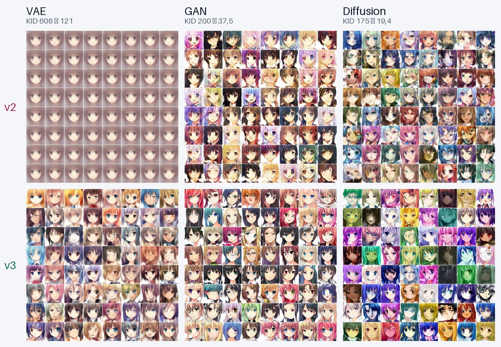
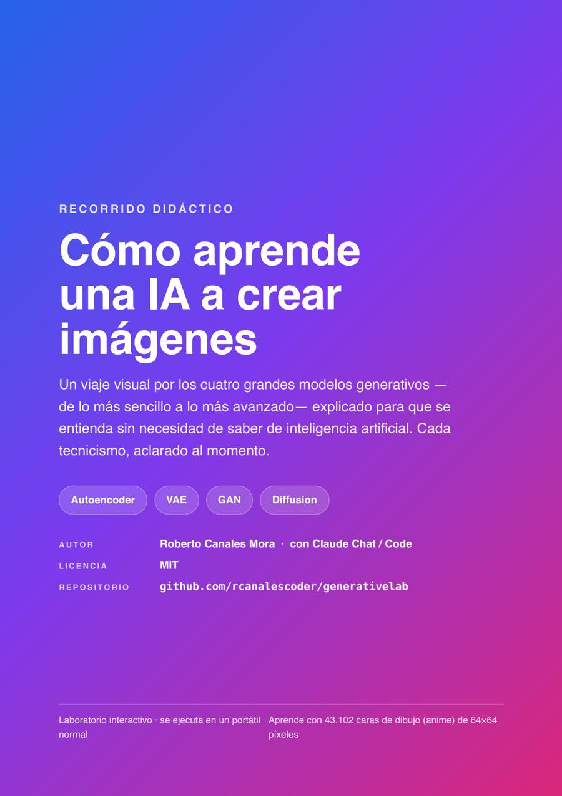
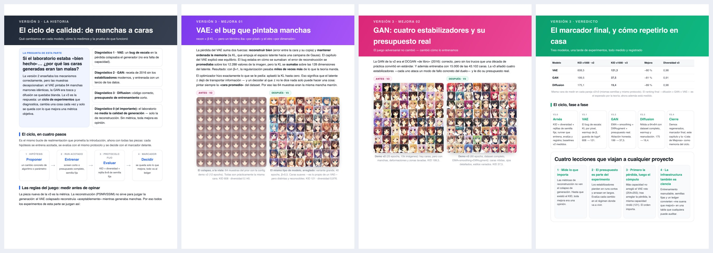
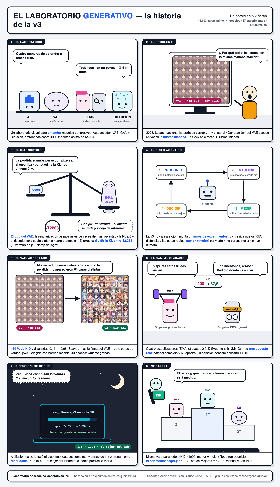
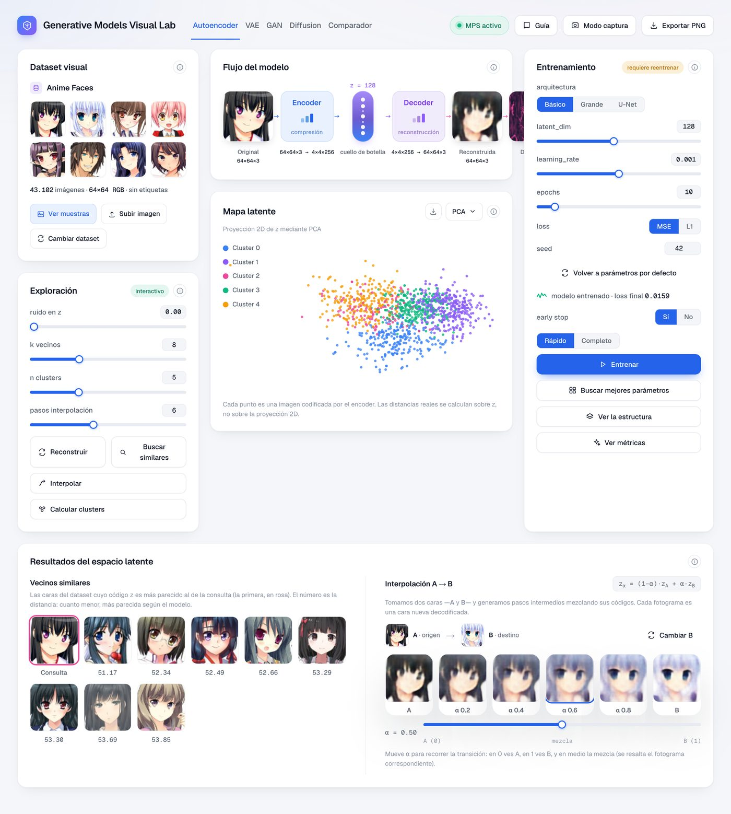
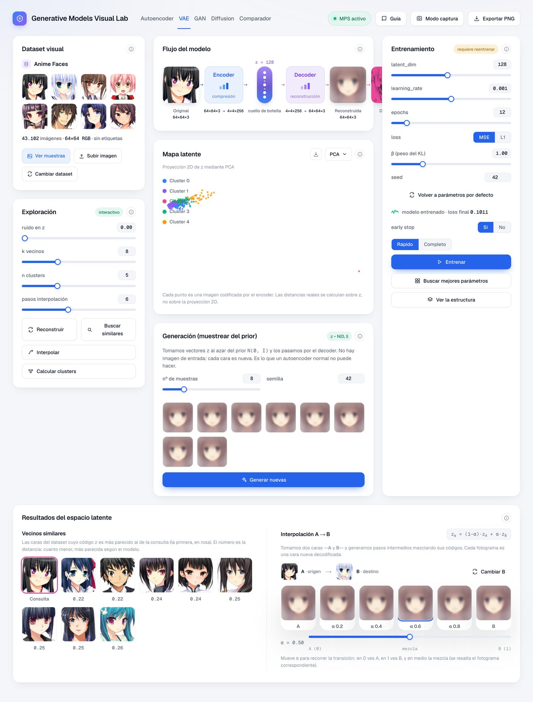
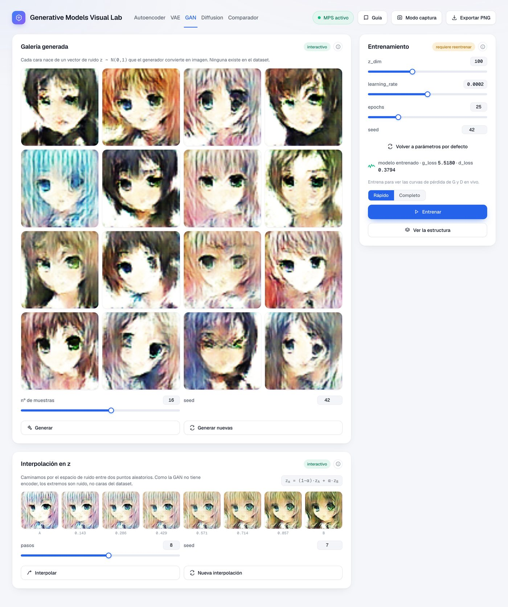
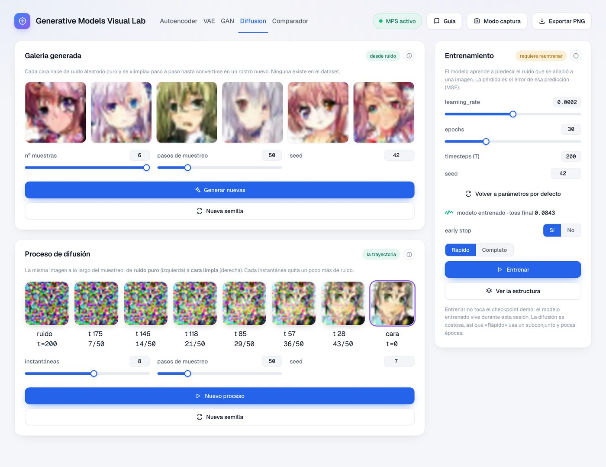
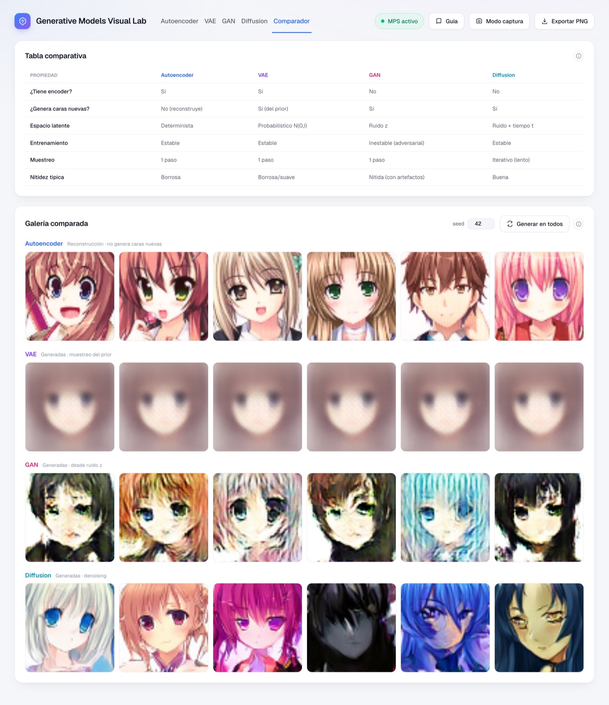

# Generative Models Visual Lab

Laboratorio visual **local** para *entender* modelos generativos sobre un dataset de caras
anime de 64×64. No es un SaaS ni se conecta a la nube: todo corre en tu máquina. Está pensado
para **tocar parámetros, ver qué ocurre y entender el porqué**, con una interfaz cuidada y
botones de información ("i") por todas partes que explican cada cosa.

Incluye cuatro modelos y un comparador:

| Pestaña | Modelo | Qué hace |
|---|---|---|
| **Autoencoder** | AE convolucional | Comprime una cara a un vector `z` y la reconstruye. Mapa latente, vecinos, interpolación. |
| **VAE** | Variational Autoencoder | Como el AE pero con latente probabilístico: **genera** caras nuevas muestreando del prior. |
| **GAN** | DCGAN | Generador vs. discriminador. Genera caras desde ruido `z` e interpola en ese espacio. |
| **Diffusion** | DDPM (UNet pequeña) | Aprende a quitar ruido paso a paso. Muestra el **proceso** de ruido → cara. |
| **Comparador** | — | Los cuatro lado a lado: tabla de capacidades + galería con la misma semilla. |

## 🆕 Novedades — versión 3: el ciclo de calidad

La v3 convirtió «mejorar las caras» en un **ciclo de experimentos medible** (17 runs registrados):
una métrica de calidad de generación (**KID**: distancia a las caras reales, menor = mejor),
un runner que entrena+evalúa+registra, y solo se adoptó lo que mejoraba el marcador.

| Modelo | Qué se cambió | KID×1000 (v2 → v3) |
|---|---|---|
| **VAE** | Se arregló el *bug de escala* de la pérdida (KL por píxel), warmup de β y guarda de logσ² | 608 → **121** (−80 %) |
| **GAN** | EMA del generador, label smoothing, DiffAugment y su presupuesto real (43k imgs × 60 epochs) | 200 → **37,5** (−81 %) |
| **Diffusion** | Variante nítida 64×64 con dataset completo, warmup de lr y entrenamiento reanudable | 175 → **19,4** (−89 %) |

<p align="center">
  
</p>

> La historia completa —diagnóstico, cada cambio de algoritmo/parámetro con su porqué y su
> evidencia run a run— está en **[«Lista de Mejoras.md»](Lista%20de%20Mejoras.md)**, en el
> [leaderboard](experiments/LEADERBOARD.md) y, contada para humanos, en el **cuaderno PDF v3** ⬇️.

## 📄 Cuaderno PDF — descárgalo (versión 3)

Un **manual visual de 55 páginas** por los cuatro modelos: qué es cada uno, su estructura, los
parámetros en lenguaje llano, **resultados reales** y el código clave. La **versión 3** añade el
capítulo del **ciclo de calidad**: el diagnóstico, los cambios exactos de algoritmos y parámetros,
y el antes/después medido de cada modelo (VAE KID 608→121 · GAN 200→37,5 · Diffusion 175→19,4).
Pensado para entenderse **sin saber de inteligencia artificial**.

<p align="center">
  <a href="docs/Laboratorio-de-Modelos-Generativos-v3.pdf">
    
  </a>
</p>

<p align="center">
  <a href="docs/Laboratorio-de-Modelos-Generativos-v3.pdf"><b>⬇️&nbsp;&nbsp;Descargar el PDF</b></a>
  &nbsp;&nbsp;·&nbsp;&nbsp;55 páginas&nbsp;&nbsp;·&nbsp;&nbsp;~5,8 MB&nbsp;&nbsp;·&nbsp;&nbsp;español
</p>

<p align="center">
  <a href="docs/Laboratorio-de-Modelos-Generativos-v3.pdf">
    
  </a>
</p>

> 💡 En GitHub puedes **leerlo online** (clic en la portada) o **descargarlo** desde el botón del
> visor. Es la mejor forma de entender el proyecto de un vistazo.

## 🎬 El proyecto, en cómic

La historia de la v3 en 8 viñetas — del «¿por qué todas las caras son la misma mancha?» al
podio final, con las cifras reales:

<p align="center">
  
</p>

---

## ✨ Características transversales

- **Botón "i" en todo**: cada tarjeta y cada grupo de parámetros tiene su explicación; además
  hay una **"Guía"** general por página. La teoría vive en JSON (`frontend/src/content/*.json`),
  no incrustada en el código.
- **Entrenamiento en vivo por SSE**: la curva de pérdida avanza en tiempo real; se puede cancelar.
- **Cómputo en Apple Silicon (MPS)** con *fallback* automático a CPU. Nunca usa CUDA.
- **Modo captura + Exportar PNG**: oculta el cromo y exporta la vista para hacer capturas limpias.
- **Búsqueda de hiperparámetros (grid search)** en AE y VAE: prueba combinaciones y elige la de
  mejor reconstrucción.
- **Checkpoints demo intocables**: entrenar desde la app nunca sobrescribe el modelo base.

---

## 🖥️ Requisitos

- **macOS con Apple Silicon** recomendado (cómputo en GPU vía MPS). También funciona en CPU,
  más lento. No requiere ni usa CUDA.
- **Python ≥ 3.11** (probado con 3.13).
- **Node ≥ 20** y **npm** (probado con Node 25 / npm 11).
- ~2 GB de disco libres (dataset cacheado ~505 MB + dependencias).

---

## 🚀 Instalación y puesta en marcha

### 1. Clonar e instalar el backend

```bash
git clone <URL-del-repo> generative-models-visual-lab
cd generative-models-visual-lab/backend

python3 -m venv .venv
source .venv/bin/activate
pip install -r requirements.txt
```

### 2. Preparar el dataset (solo la primera vez)

Descarga el `data.zip` de [`huggan/anime-faces`](https://huggingface.co/datasets/huggan/anime-faces)
(~462 MB) y construye un cache local en `backend/data/anime-faces/faces_64.npy`:

```bash
# desde backend/ con el venv activado
python -m app.data.dataset
```

> El `data.zip` publicado contiene **43.102** imágenes 64×64 RGB (la ficha del dataset menciona
> 21.551; la app usa y muestra el recuento real). Sin etiquetas: es aprendizaje no supervisado.

### 3. Generar los checkpoints demo (opcional pero recomendado)

Para que las pestañas estén listas al instante, entrena los modelos demo. Desde la **v3**
(ver `Lista de Mejoras.md`: el ciclo de calidad que llevó el VAE de KID 608→121 y el GAN de
200→37) los demos de calidad se generan con el *runner* de experimentos. Cada comando guarda su
checkpoint en `backend/app/checkpoints/<modelo>_demo.pt` (tiempos medidos en un M-series con MPS):

```bash
# desde backend/ con el venv activado
export PYTORCH_ENABLE_MPS_FALLBACK=1

# VAE v3 (KL por píxel + warmup; ~2 min basico · ~10 min grande)
python -m app.experiments.runner --model vae --tag demo --mode full \
    --hp '{"epochs":40,"beta":0.5,"arch":"basico"}' --save-ckpt app/checkpoints/vae_basico_demo.pt
python -m app.experiments.runner --model vae --tag demo-grande --mode full \
    --hp '{"epochs":40,"beta":0.5,"arch":"grande"}' --save-ckpt app/checkpoints/vae_grande_demo.pt

# GAN v3 (EMA + label smoothing + DiffAugment; ~22 min)
python -m app.experiments.runner --model gan --tag demo --mode full \
    --hp '{"epochs":60}' --save-ckpt app/checkpoints/gan_basico_demo.pt

# Diffusion «nitido» v3 (largo y REANUDABLE: puedes cortar y seguir con --resume; ~1-2 h)
python -m app.experiments.train_diffusion_v3 --epochs 28

# AE y diffusion «agil» (demos clásicos de la v2)
python -m app.services.ae_service          # Autoencoder   (~3 min)
python -m app.services.diffusion_service   # Diffusion     (agil 32×32 + nitido corto)
```

Cada run del runner queda registrado en `experiments/ledger.jsonl` con sus métricas (KID,
diversidad) y su rejilla de muestras en `experiments/grids/` — el leaderboard vivo está en
`experiments/LEADERBOARD.md`.

Si no quieres esperar, **puedes saltarte este paso**: cada pestaña muestra un estado "sin
entrenar" y puedes pulsar **Entrenar** (modo *Rápido*) en la propia UI para obtener un modelo
utilizable en segundos (con menor calidad que el demo completo).

### 4. Instalar y arrancar el frontend

```bash
cd ../frontend
npm install
npm run dev        # http://localhost:5173
```

El backend se arranca aparte (puerto 8000):

```bash
cd ../backend && source .venv/bin/activate
PYTORCH_ENABLE_MPS_FALLBACK=1 uvicorn app.main:app --port 8000
```

En desarrollo, Vite hace de **proxy** de `/api/*` → `http://localhost:8000`. Cuando ambos
están vivos, la pastilla "MPS activo" del header se pone verde.

### 5. Atajos: `arrancar.sh` y `parar.sh`

Desde la raíz del proyecto, puedes levantar (o **reinicia**, si ya estaban corriendo) backend + frontend con:

```bash
./arrancar.sh
# abre http://localhost:5173
```

Para detener adecuadamente ambos servicios (liberando los puertos `8000` y `5173` y limpiando los archivos de PIDs), ejecuta:

```bash
./parar.sh
```

Comprobación rápida del backend:

```bash
curl http://localhost:8000/api/health
# {"status":"ok","device":"mps","device_name":"Apple Silicon GPU (MPS)", ...}
```

---

## 🧠 Cómo funciona cada modelo

Todos comparten encoder/decoder convolucionales (64×64×3 ⇄ vector latente) salvo donde se
indica. En la app, cada panel tiene su botón "i" con esta misma explicación, ampliada.

### Autoencoder (AE)
Una red con forma de reloj de arena: el **encoder** comprime la imagen (12.288 números) a un
vector pequeño `z` (`latent_dim`); el **decoder** intenta reconstruir la imagen solo a partir de
`z`. Como `z` es mucho menor que la imagen, el modelo se ve obligado a quedarse con lo esencial.
Se entrena minimizando el error de reconstrucción (MSE o L1).
- **Mapa latente**: proyección 2D (PCA/UMAP) de los `z`, coloreada por clusters (k-means).
- **Vecinos**: imágenes con `z` más cercano (similares según el modelo).
- **Interpolación A→B**: caminar en línea recta entre dos `z` y decodificar cada paso.
- **Grid search**: busca la mejor `latent_dim`/`lr`/`loss` por MSE de reconstrucción.

<p align="center"><br/><sub>Flujo <i>original → encoder → z → decoder → reconstruida → diferencia</i>, mapa latente, vecinos e interpolación.</sub></p>

### VAE (Variational Autoencoder)
Igual que el AE, pero el encoder produce una **distribución** (media `μ` y varianza `σ²`) en
lugar de un punto. Se muestrea `z = μ + σ·ε` (reparametrización) y se añade el término **KL**
que empuja el latente hacia un prior `N(0, I)`. El parámetro **β** controla el equilibrio
reconstrucción ↔ regularidad. Como el latente queda ordenado, el VAE puede **generar caras
nuevas** muestreando del prior (panel "Generación"). La curva separa pérdida de reconstrucción y KL.

<p align="center"><br/><sub>El mismo flujo que el AE más un panel de <b>Generación</b>: caras nuevas muestreadas del prior.</sub></p>

### GAN (DCGAN)
Dos redes compiten: el **generador** crea caras a partir de ruido `z`; el **discriminador**
intenta distinguir reales de falsas. Entrenan en un juego adversarial (pérdidas `g_loss`/`d_loss`).
No hay encoder, así que **no reconstruye ni tiene mapa latente**: solo genera e interpola en el
espacio de ruido. Suele dar las caras más nítidas pero es **inestable** de entrenar.

<p align="center"><br/><sub>Galería de caras generadas desde ruido, paseo entre dos semillas y las dos curvas del duelo G/D.</sub></p>

### Diffusion (DDPM)
Aprende el proceso inverso de "ensuciar" una imagen. **Forward**: se añade ruido gaussiano poco
a poco hasta ruido puro. **Reverse**: la red aprende a predecir y quitar ese ruido paso a paso.
Para generar, parte de ruido puro y lo va limpiando hasta una cara (panel "Proceso de difusión",
que muestra la trayectoria). Hay dos variantes: una **ágil** (32×32, rápida para ver la dinámica)
y una **nítida** (64×64 con auto-atención, mejor calidad); más pasos de muestreo = mejor calidad
pero más lento.

<p align="center"><br/><sub>La estrella es el <b>Proceso de difusión</b>: la trayectoria de <i>ruido puro → cara limpia</i>, paso a paso.</sub></p>

### Comparador
Pone los cuatro lado a lado: una **tabla** (¿encoder?, ¿genera?, tipo de latente, estabilidad,
muestreo, nitidez) y una **galería** que, con la misma semilla, muestra la salida de cada modelo
(el AE reconstruye; VAE/GAN/Diffusion generan).

<p align="center"><br/><sub>Los cuatro modelos lado a lado con la misma semilla: compara estilo, nitidez y diversidad de un vistazo.</sub></p>

---

## 🏗️ Arquitectura

**Frontend** — Vite 8 + React 19 + TypeScript + Tailwind v4. Sistema de componentes **propio**
(sin librerías de UI externas) en `src/components/ui`, con tokens de diseño en
`src/styles/tokens.css`. La teoría de los "i" se carga desde `src/content/*.json`.

**Backend** — FastAPI + PyTorch en un venv propio. Un *router* y un *servicio* por modelo. El
entrenamiento se transmite por **SSE** (Server-Sent Events), no por polling.

Patrones clave (reutilizados en los cuatro modelos):

- **Entrenamiento robusto**: el bucle corre en un *hilo daemon* que empuja eventos a una cola;
  el endpoint SSE relé desde la cola y, si el cliente se desconecta, cancela el entrenamiento.
  Así el estado nunca se queda "colgado".
- **Checkpoints intocables**: entrenar desde la app actualiza el modelo **en memoria** (dura lo
  que dura el servidor); solo el script `python -m app.services.<m>_service` escribe el
  `*_demo.pt`. Reiniciar el backend siempre vuelve al demo pristino.
- **MPS con fallback**: `app/device.py` detecta el dispositivo; se exporta
  `PYTORCH_ENABLE_MPS_FALLBACK=1` para operaciones no soportadas en MPS.

---

## 📁 Estructura del proyecto

```
generative-models-visual-lab/
├── arrancar.sh                     # arranca/reinicia backend + frontend
├── parar.sh                        # detiene ordenadamente backend + frontend
├── CLAUDE.md / GUIA-FASES.md       # especificación y guía por fases
├── design/mockup.html              # referencia visual del tab Autoencoder
├── backend/
│   ├── requirements.txt
│   ├── data/anime-faces/           # dataset cacheado (gitignored)
│   └── app/
│       ├── main.py                 # FastAPI: CORS, routers, carga de checkpoints
│       ├── device.py · seeding.py · imaging.py
│       ├── data/dataset.py         # descarga + cache del dataset
│       ├── models/                 # ae.py · vae.py · gan.py · diffusion.py
│       ├── services/               # un *_service.py por modelo (entrenamiento, latente, etc.)
│       ├── routers/                # un router por modelo + dataset, health, upload
│       └── checkpoints/            # *_demo.pt (gitignored)
└── frontend/
    └── src/
        ├── App.tsx · layout/Header.tsx
        ├── components/ui/          # sistema de componentes propio
        ├── components/lab/         # DatasetCard, LatentMap, ResultsCard, TrainingChart, GridSearchModal…
        ├── components/info/        # InfoPanel + InfoProvider (las pantallas "i")
        ├── content/*.json          # teoría de cada modelo
        ├── lib/api*.ts             # cliente HTTP/SSE (uno por modelo)
        └── tabs/                   # AutoencoderTab, VAETab, GANTab, DiffusionTab, ComparatorTab
```

---

## 🔌 API (resumen)

Todo bajo el prefijo `/api`. Comunes: `GET /health`, `GET /dataset/info`,
`GET /dataset/samples`, `GET /dataset/image/{id}`, `POST /upload`.

| Modelo | Endpoints principales |
|---|---|
| `autoencoder` | `status`, `train` (SSE), `train/cancel`, `gridsearch` (SSE), `reconstruct`, `projection`, `neighbors`, `cluster`, `interpolate` |
| `vae` | igual que AE + `generate` (muestrear del prior) |
| `gan` | `status`, `train` (SSE), `train/cancel`, `generate`, `interpolate` |
| `diffusion` | `status`, `train` (SSE), `train/cancel`, `generate`, `trajectory` (ruido → cara) |

Con el backend levantado, la documentación interactiva está en `http://localhost:8000/docs`.

---

## 🧰 Scripts (`frontend/`)

| Script | Qué hace |
|---|---|
| `npm run dev` | Servidor de desarrollo con HMR |
| `npm run build` | Type-check (`tsc -b`) + build de producción |
| `npm run preview` | Sirve el build de producción |
| `npm run lint` | ESLint |

---

## ⚠️ Notas y limitaciones

- **Modelos pequeños a propósito** (64×64, entrenables en local): el objetivo es *ver el
  mecanismo*, no competir con modelos grandes. Desde la v3 la calidad además está **medida**
  (KID por modelo en el [leaderboard](experiments/LEADERBOARD.md)); los demos v3 generan caras
  nítidas en GAN/Diffusion y suaves —su firma— en el VAE.
- **Diffusion tiene dos variantes**: *ágil* (32×32, interactiva, ideal para trastear) y
  *nítida* (64×64 nativa con atención — el demo de calidad de la v3; muestrear es más lento).
- **Primer arranque sin checkpoints**: las pestañas funcionan igual, mostrando "sin entrenar";
  entrena desde la UI o genera los demos (paso 3).
- **Dataset y checkpoints no van al repositorio** (`.gitignore`): se generan/descargan en local.

---

## 📜 Licencia y créditos

- Dataset: [`huggan/anime-faces`](https://huggingface.co/datasets/huggan/anime-faces) (CC0).
- Código del laboratorio: **MIT** (ver [`LICENSE`](LICENSE)). © 2026 Roberto Canales Mora — con Claude Chat / Code.
